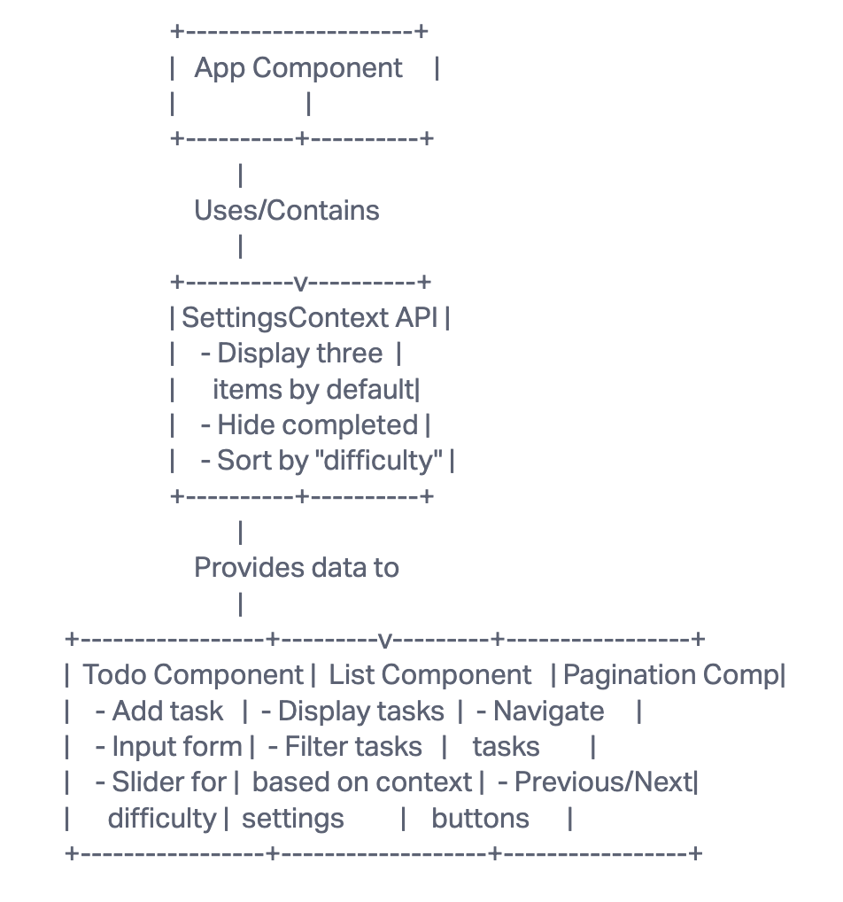

# LAB - Context API

## To Do List Manager Phase 1

Incorporate configuration settings to the application.

### Overview

Currently, users can add todo tasks to the proof-of-life starter application. In this phase, we'll introduce default context settings into the app, allowing the user to view three incomplete todo tasks. Additionally, pagination will enable users to view any other incomplete tasks.

### Phase 1 Requirements

In this phase, we're refactoring a Todo app developed by another team. The aim is to make the application production-ready by integrating Context API, ensuring modularity, and incorporating the Mantine Component API for styling.

- Draft a detailed UML.
- Modularize the application (follow the proposed file structure).
- Incorporate the Context API for managing application settings.
- Default settings:
- Display three items.
- Hide completed tasks.
- Sort by 'difficulty'.
- Style with Mantine Component API. Remember, achieving 80% of the design might consume only 20% of the time. Aim to get the design mostly right by the week's end.

